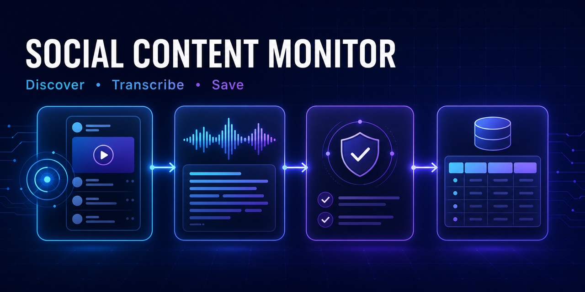
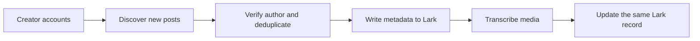

# 📡 Social Content Monitor Skills

[中文](README.md) · [English](README.en.md)

[](https://agentskills.io)
[](LICENSE)
[](https://github.com/wulitou-shubing/social-content-monitor-skills/releases)
[](https://skills.sh/wulitou-shubing/social-content-monitor-skills)
[](https://github.com/wulitou-shubing/social-content-monitor-skills/actions/workflows/validate.yml)



#### Discover new creator posts, transcribe spoken video, and save structured results to Lark Base

Give your Agent a list of creator accounts on Douyin, Xiaohongshu, or another supported platform. It discovers new posts, verifies authorship, avoids duplicate records, transcribes spoken video, and writes metadata plus transcripts to Lark Base.

You can also use the media Skill on its own. Give it a video URL, local video, or audio file and receive a timestamped transcript and SRT subtitles.

The repository follows the [Agent Skills open format](https://agentskills.io). Claude Code, Codex, and other clients compatible with `SKILL.md` can load the Skills. Full monitoring also requires browser or platform access, an authorized Lark integration, and a scheduler if recurring runs are needed.

## ⚡ Install

The repository has been tested with the skills.sh CLI. This command discovers and installs both Skills.

```bash
npx skills add wulitou-shubing/social-content-monitor-skills
```

Install one Skill when you do not need the full workflow.

```bash
npx skills add wulitou-shubing/social-content-monitor-skills --skill video-audio-transcribe
npx skills add wulitou-shubing/social-content-monitor-skills --skill social-content-monitor-to-lark
```

Clients that support Agent Skills can also install the Skill folders directly.

```text
https://github.com/wulitou-shubing/social-content-monitor-skills/tree/main/skills/video-audio-transcribe
https://github.com/wulitou-shubing/social-content-monitor-skills/tree/main/skills/social-content-monitor-to-lark
```

If your client cannot install from a URL, download the complete Skill folder and place it in the client-specific Skills directory. Do not copy only `SKILL.md` because the bundled scripts and references are required.

## 📋 Included Skills

| Skill | What it does | Standalone use |
| --- | --- | --- |
| [video-audio-transcribe](skills/video-audio-transcribe) | Downloads or reads media and produces timestamped TXT and SRT transcripts | Yes |
| [social-content-monitor-to-lark](skills/social-content-monitor-to-lark) | Monitors creator accounts and writes new posts, metrics, and transcripts to Lark Base | Yes, but video transcription requires the companion Skill |



## 🎙️ Video and audio transcription

`video-audio-transcribe` can

- download supported online media that the user is authorized to access
- extract MP3 audio from a local video
- recognize speech in Chinese and other languages with faster-whisper
- output timestamped TXT and SRT files
- preserve the evidence transcript before editorial cleanup
- flag uncertain names, figures, brands, and specialist terms for review

Example prompt

```text
Transcribe this video. Keep a timestamped source transcript, create SRT subtitles, and flag uncertain names or numbers instead of guessing.

Replace this line with a video URL or local media path.
```

Requirements include Python 3.10 or newer, `ffmpeg`, and the packages in [requirements.txt](skills/video-audio-transcribe/requirements.txt). The first use of a Whisper model may download model files.

## 🛰️ Social monitoring to Lark

`social-content-monitor-to-lark` can

- manage multiple platforms and creator accounts
- reject pinned posts, recommendations, and content from another author
- deduplicate with stable content IDs or canonical URLs
- save title, publication time, URL, caption, and available engagement metrics
- transcribe spoken video with the companion Skill
- mark posts without transcribable speech as `not_applicable`
- retain failed records for recovery without creating duplicate rows
- establish a first-run baseline before recurring monitoring

Example prompt

```text
Use social-content-monitor-to-lark to monitor the public creator account below and save new posts to my Lark Base.

Creator profile
Replace this line with the platform name and profile URL.

Lark Base
Replace this line with the Base URL.

Check the environment and field schema first. Test one account, establish a baseline without importing history, and do not create a recurring schedule yet.
```

The repository currently includes adapter guidance for Douyin, Xiaohongshu, TikTok, and YouTube. Other platforms require a verified stable creator ID, stable content ID, creator-owned content surface, pinned-content rule, and authorized media access policy.

See the [sanitized demo](docs/demo.en.md) for an example record and timestamped transcript. It uses fictional data and contains no real accounts, credentials, or private URLs.

## 🧩 Compatibility

Skill format compatibility does not give every Agent client the same tools.

| Client capability | Single media transcription | Full monitoring |
| --- | --- | --- |
| Read files and run Python | Local media | Insufficient |
| Network access and `ffmpeg` | Supported online media | Insufficient |
| Signed-in browser or official platform API | Yes | Discover new posts |
| Lark connector, OpenAPI, or `lark-cli` | Yes | Write to Lark Base |
| Scheduler or automation | Yes | Recurring monitoring |

Codex users can use `lark-shared` and `lark-base`. Other clients may use their own Lark connector, MCP server, official OpenAPI integration, or `lark-cli`. Manual monitoring remains available without a scheduler.

## 🔒 Safety boundaries

The Skills do not

- bypass CAPTCHA, login verification, rate limits, private accounts, or paywalls
- spoof browser fingerprints
- automate likes, follows, comments, direct messages, or publishing
- download, transcribe, or distribute content without authorization
- export or print browser cookies

Monitoring stops when a platform requests verification, reports unusual traffic, or expires the login session.

Whisper output is a draft transcript. Review names, brands, figures, and specialist terms against the original media.

## 🌟 Support and contributing

Use [Issues](https://github.com/wulitou-shubing/social-content-monitor-skills/issues) for reproducible bugs and feature requests. Use [Discussions](https://github.com/wulitou-shubing/social-content-monitor-skills/discussions) for usage questions and platform ideas.

Read [Contributing](.github/CONTRIBUTING.md) and the [Security Policy](.github/SECURITY.md) before posting. If the project helps you, a Star makes it easier for other Agent users to find it.

This repository is available under the [MIT License](LICENSE). The license does not change the copyright or usage conditions of platform content.
